# Google A2A Demo: Currency & Reporting Agent Integration

A comprehensive demonstration of **Agent-to-Agent (A2A) Protocol** integration using LangGraph framework. This project showcases how multiple AI agents can communicate seamlessly using standardized A2A protocol for currency conversion and reporting workflows.

## 🎯 Project Overview

This project demonstrates a complete A2A ecosystem with three main components:

1. **Currency Agent** - Handles currency conversion requests and orchestrates the workflow
2. **Reporting Agent** - Generates comprehensive reports for currency conversions
3. **Integration Test Suite** - Validates the complete A2A workflow

### Key Features

- ✅ **Full A2A Protocol Compliance** - Standard agent cards, message structure, streaming
- ✅ **Agent-to-Agent Communication** - Currency Agent calls Reporting Agent via A2A
- ✅ **LangGraph Integration** - ReAct agents with memory and tool usage
- ✅ **Real-time Streaming** - Status updates during workflow execution
- ✅ **Multi-turn Conversations** - Context preservation across interactions
- ✅ **Comprehensive Testing** - Automated and interactive test suites

## 🏗️ Architecture

### System Components

```mermaid
graph TB
    User[👤 User] --> CurrencyAgent[💱 Currency Agent<br/>Port: 5001]
    CurrencyAgent --> FrankfurterAPI[🌐 Frankfurter API<br/>Exchange Rates]
    CurrencyAgent --> ReportingAgent[📊 Reporting Agent<br/>Port: 5002]
    ReportingAgent --> CurrencyAgent
    CurrencyAgent --> User
    
    subgraph "A2A Protocol"
        CurrencyAgent -.->|A2A Client| ReportingAgent
        ReportingAgent -.->|A2A Server| CurrencyAgent
    end
    
    subgraph "External APIs"
        FrankfurterAPI
    end
```



### Complete Workflow Sequence

```mermaid
sequenceDiagram
    participant User as 👤 User
    participant CurrencyAgent as 💱 Currency Agent
    participant FrankfurterAPI as 🌐 Frankfurter API
    participant ReportingAgent as 📊 Reporting Agent

    User->>CurrencyAgent: "Convert 100 USD to EUR"
    Note over CurrencyAgent: A2A Server receives request
    
    CurrencyAgent->>CurrencyAgent: Parse currency request
    CurrencyAgent->>User: 🔄 "Looking up exchange rates..."
    
    CurrencyAgent->>FrankfurterAPI: GET /latest?from=USD&to=EUR
    FrankfurterAPI->>CurrencyAgent: {"rates": {"EUR": 0.85}, "date": "2024-01-15"}
    
    CurrencyAgent->>User: 🔄 "Generating comprehensive report..."
    
    Note over CurrencyAgent,ReportingAgent: A2A Client-to-Server Communication
    CurrencyAgent->>ReportingAgent: A2A Request: Generate report
    Note over ReportingAgent: Process conversion data
    ReportingAgent->>CurrencyAgent: A2A Response: Detailed report
    
    CurrencyAgent->>User: 📄 Combined Response:<br/>- Exchange Rate: 1 USD = 0.85 EUR<br/>- Comprehensive Report with Analysis
```



### A2A Protocol Flow


## 🚀 Quick Start

### Prerequisites

1. **Python 3.12+** with pip
2. **Google API Key** for Gemini
3. **Internet connection** for Frankfurter API

### Installation

```bash
# Clone and navigate to project
git clone <repository-url>
cd googlea2a-demo

# Install uv (if not already installed)
curl -LsSf https://astral.sh/uv/install.sh | sh

# Install dependencies with uv
uv sync

# Set environment variable
export GOOGLE_API_KEY=your_actual_google_api_key_here
```

### Development Commands

```bash
# Install development dependencies
uv sync --group dev

# Run tests
uv run pytest

# Format code
uv run black .
uv run isort .

# Type checking
uv run mypy currency_agent reporting_agent

# Add new dependencies
uv add package-name

# Add development dependencies
uv add --group dev package-name

# Update dependencies
uv lock --upgrade

# Create a new virtual environment
uv venv

# Activate virtual environment
source .venv/bin/activate  # On macOS/Linux
# or
.venv\Scripts\activate     # On Windows
```

### Running the System

#### Terminal 1: Start Currency Agent
```bash
uv run python -m currency_agent --host localhost --port 5001
```

**Expected Output:**
```
INFO:     Started server process [12345]
INFO:     Waiting for application startup.
INFO:     Application startup complete.
INFO:     Uvicorn running on http://localhost:5001 (Press CTRL+C to quit)
```

#### Terminal 2: Start Reporting Agent
```bash
uv run python -m reporting_agent --host localhost --port 5002
```

**Expected Output:**
```
INFO:     Started server process [12346]
INFO:     Waiting for application startup.
INFO:     Application startup complete.
INFO:     Uvicorn running on http://localhost:5002 (Press CTRL+C to quit)
```

#### Terminal 3: Run Integration Tests
```bash
# Comprehensive automated tests
uv run python test/integration_test_client.py

# Interactive manual testing
uv run python test/interactive_integration_test.py

# Structure validation (no API key needed)
uv run python test/simple_integration_test.py
```

## 📊 Example Usage & Output

### Basic Currency Conversion

**Input:**
```bash
curl -X POST http://localhost:5001 \
  -H "Content-Type: application/json" \
  -d '{
    "id": "test-123",
    "jsonrpc": "2.0",
    "method": "message/send",
    "params": {
      "message": {
        "kind": "message",
        "messageId": "msg-123",
        "parts": [{"kind": "text", "text": "Convert 100 USD to EUR"}],
        "role": "user"
      }
    }
  }'
```

**Expected Output:**
```json
{
  "id": "test-123",
  "jsonrpc": "2.0",
  "result": {
    "artifacts": [
      {
        "artifactId": "currency-report-456",
        "name": "currency_conversion_with_report",
        "parts": [
          {
            "kind": "text",
            "text": "Currency Conversion Report\n========================\n\nConversion Details:\n- From: USD\n- To: EUR\n- Exchange Rate: 0.85\n- Date: 2024-01-15\n\nAnalysis:\nThis conversion shows the current exchange rate between USD and EUR.\nThe rate of 0.85 means that 1 USD equals 0.85 EUR.\n\nFor 100 USD, you would receive 85.00 EUR.\n\nRaw API Response:\n{\n  \"amount\": 100.0,\n  \"base\": \"USD\",\n  \"date\": \"2024-01-15\",\n  \"rates\": {\n    \"EUR\": 0.85\n  }\n}\n\nSession ID: default-session\nReport Generated Successfully"
          }
        ]
      }
    ],
    "contextId": "ctx-789",
    "history": [
      {
        "kind": "message",
        "messageId": "msg-123",
        "parts": [{"kind": "text", "text": "Convert 100 USD to EUR"}],
        "role": "user",
        "taskId": "task-456"
      }
    ],
    "id": "task-456",
    "kind": "task",
    "status": {"state": "completed"}
  }
}
```

### Streaming Response Example

**Input:**
```bash
curl -X POST http://localhost:5001 \
  -H "Content-Type: application/json" \
  -d '{
    "id": "stream-123",
    "jsonrpc": "2.0",
    "method": "message/stream",
    "params": {
      "message": {
        "kind": "message",
        "messageId": "stream-msg-123",
        "parts": [{"kind": "text", "text": "Convert 50 GBP to JPY with analysis"}],
        "role": "user"
      }
    }
  }'
```

**Expected Streaming Output:**
```
data: {"id":"stream-123","jsonrpc":"2.0","result":{"status":{"state":"submitted"}}}

data: {"id":"stream-123","jsonrpc":"2.0","result":{"kind":"status-update","status":{"state":"working","message":{"parts":[{"kind":"text","text":"Looking up the exchange rates..."}]}}}}

data: {"id":"stream-123","jsonrpc":"2.0","result":{"kind":"status-update","status":{"state":"working","message":{"parts":[{"kind":"text","text":"Generating comprehensive report..."}]}}}}

data: {"id":"stream-123","jsonrpc":"2.0","result":{"kind":"artifact-update","artifact":{"name":"currency_conversion_with_report","parts":[{"kind":"text","text":"Currency Conversion Report\n========================\n\nConversion Details:\n- From: GBP\n- To: JPY\n- Exchange Rate: 150.25\n..."}]}}}

data: {"id":"stream-123","jsonrpc":"2.0","result":{"kind":"status-update","status":{"state":"completed"},"final":true}}
```

### Multi-turn Conversation Example

**First Message:**
```bash
curl -X POST http://localhost:5001 \
  -H "Content-Type: application/json" \
  -d '{
    "id": "multi-1",
    "jsonrpc": "2.0",
    "method": "message/send",
    "params": {
      "message": {
        "kind": "message",
        "messageId": "multi-msg-1",
        "parts": [{"kind": "text", "text": "I need currency conversion help"}],
        "role": "user"
      }
    }
  }'
```

**Expected Response:**
```json
{
  "id": "multi-1",
  "jsonrpc": "2.0",
  "result": {
    "contextId": "ctx-multi-123",
    "id": "task-multi-456",
    "kind": "task",
    "status": {
      "state": "input-required",
      "message": {
        "parts": [{"kind": "text", "text": "Please specify the currencies and amount you'd like to convert."}]
      }
    }
  }
}
```

**Follow-up Message:**
```bash
curl -X POST http://localhost:5001 \
  -H "Content-Type: application/json" \
  -d '{
    "id": "multi-2",
    "jsonrpc": "2.0",
    "method": "message/send",
    "params": {
      "message": {
        "kind": "message",
        "messageId": "multi-msg-2",
        "parts": [{"kind": "text", "text": "200 CAD to AUD"}],
        "role": "user",
        "taskId": "task-multi-456",
        "contextId": "ctx-multi-123"
      }
    }
  }'
```

## 🧪 Testing

### Test Suite Overview

| Test File | Purpose | API Key Required |
|-----------|---------|------------------|
| `test/simple_integration_test.py` | Structure validation | ❌ No |
| `test/integration_test_client.py` | Full automated tests | ✅ Yes |
| `test/interactive_integration_test.py` | Manual testing | ✅ Yes |

### Running Tests

#### 1. Structure Validation (No API Key)
```bash
uv run python test/simple_integration_test.py
```

**Expected Output:**
```
============================================================
  SIMPLE INTEGRATION TEST
  Currency + Reporting Agent
============================================================
✅ PASSED: Agent Cards
✅ PASSED: Currency Agent Structure
✅ PASSED: Reporting Agent Structure
✅ PASSED: Integration Readiness

Overall: 4/4 tests passed

🎉 ALL TESTS PASSED!
The A2A integration structure is working correctly.
```

#### 2. Comprehensive Integration Tests
```bash
uv run python test/integration_test_client.py
```

**Expected Output:**
```
================================================================================
  CURRENCY + REPORTING AGENT INTEGRATION TEST
================================================================================
✅ Currency Agent is available at http://localhost:5001
✅ Reporting Agent is available at http://localhost:5002

================================================================================
  BASIC INTEGRATION TEST
================================================================================
📤 Request: How much is 100 USD in EUR?
✅ Currency Agent responded with status: completed
📄 Artifact: currency_conversion_with_report
✨ Response contains both exchange rate AND comprehensive report!

================================================================================
  STREAMING INTEGRATION TEST
================================================================================
🔄 [1] Status: working - Looking up the exchange rates...
🔄 [2] Status: working - Generating comprehensive report...
📄 [3] Final Result: currency_conversion_with_report
✅ Streaming completed with 3 updates

🎉 All integration tests completed successfully!
```

#### 3. Interactive Testing
```bash
uv run python test/interactive_integration_test.py
```

**Interactive Menu:**
```
============================================================
Test Options:
1. Quick test with sample conversion
2. Enter custom currency conversion
3. Test streaming response
4. Test multi-turn conversation
5. Send custom message
6. Exit
============================================================
Enter your choice (1-6): 1

📊 Testing sample conversion: 100 USD to EUR
📤 Sending: Convert 100 USD to EUR and provide a detailed analysis
📥 Response Status: completed
📄 Generated 1 artifact(s):

--- currency_conversion_with_report ---
Currency Conversion Report
========================

Conversion Details:
- From: USD
- To: EUR
- Exchange Rate: 0.85
- Date: 2024-01-15

Analysis:
This conversion shows the current exchange rate between USD and EUR.
The rate of 0.85 means that 1 USD equals 0.85 EUR.

✨ SUCCESS: Integrated response with exchange rate AND report!
```

## 📁 Project Structure

```
googlea2a-demo/
├── currency_agent/              # Currency Agent Implementation
│   ├── __init__.py
│   ├── __main__.py              # CLI entry point
│   ├── agent.py                 # LangGraph agent with A2A client
│   ├── executor.py              # A2A protocol executor
│   ├── server.py                # A2A server setup
│   └── test_client.py           # Individual agent tests
├── reporting_agent/             # Reporting Agent Implementation
│   ├── __init__.py
│   ├── __main__.py              # CLI entry point
│   ├── agent.py                 # LangGraph agent for reporting
│   ├── executor.py              # A2A protocol executor
│   ├── server.py                # A2A server setup
│   ├── test_client.py           # Individual agent tests
│   ├── interactive_test.py      # Interactive testing
│   └── README.md                # Reporting agent documentation
├── test/                        # Integration Test Suite
│   ├── integration_test_client.py      # Comprehensive automated tests
│   ├── interactive_integration_test.py # Interactive manual testing
│   ├── simple_integration_test.py      # Structure validation
│   └── README.md                       # Test documentation
├── pyproject.toml               # Project dependencies (uv compatible)
└── README.md                    # This file
```

## 🔧 Technical Implementation

### A2A Protocol Integration

Both agents implement the A2A protocol using:

- **Agent Cards** - Standard capability and skill definitions
- **JSON-RPC 2.0** - Message protocol for communication
- **Streaming Support** - Real-time status updates
- **Task Management** - Stateful conversation handling
- **Error Handling** - Graceful failure management

### LangGraph Framework

Each agent uses LangGraph's ReAct pattern:

```python
# Agent creation with tools and memory
self.graph = create_react_agent(
    self.model,
    tools=self.tools,
    checkpointer=memory,
    prompt=self.SYSTEM_INSTRUCTION,
    response_format=(self.FORMAT_INSTRUCTION, ResponseFormat),
)
```

### Tools Implementation

#### Currency Agent Tools:
- `get_exchange_rate()` - Fetches rates from Frankfurter API
- `call_reporting_agent()` - A2A client for reporting agent

#### Reporting Agent Tools:
- `generate_currency_report()` - Creates detailed reports
- `format_conversion_summary()` - Brief summaries

## 🐛 Troubleshooting

### Common Issues

#### 1. "Connection refused" errors
```bash
# Check if agents are running
ps aux | grep -E "(currency|reporting)_agent"

# Restart agents
pkill -f "python -m currency_agent"
pkill -f "python -m reporting_agent"
```

#### 2. "GOOGLE_API_KEY not set" errors
```bash
# Set environment variable
export GOOGLE_API_KEY=your_actual_api_key_here

# Verify it's set
echo $GOOGLE_API_KEY
```

#### 3. "Internal error" responses
- Usually indicates missing or invalid API key
- Check agent logs for detailed error messages
- Verify Gemini API key is valid and has quota

#### 4. Port conflicts
```bash
# Check what's using the ports
lsof -i :5001
lsof -i :5002

# Use different ports if needed
uv run python -m currency_agent --host localhost --port 5003
uv run python -m reporting_agent --host localhost --port 5004
```

### Debug Mode

Enable detailed logging:
```bash
export PYTHONPATH=.
uv run python -c "
import logging
logging.basicConfig(level=logging.DEBUG)
" && uv run python test/integration_test_client.py
```

## 🚀 Deployment

### Production Considerations

1. **Environment Variables**
   ```bash
   export GOOGLE_API_KEY=prod_key_here
   export HOST_OVERRIDE=your-domain.com
   ```

2. **Docker Deployment**
   ```bash
   # Build containers
   docker build -t currency-agent .
   docker build -t reporting-agent .
   
   # Run with proper networking
   docker run -p 5001:5001 -e GOOGLE_API_KEY=key currency-agent
   docker run -p 5002:5002 -e GOOGLE_API_KEY=key reporting-agent
   ```

3. **Load Balancing**
   - Use nginx or similar for load balancing
   - Configure health checks on `/.well-known/agent.json`

## 📚 Additional Resources

- [A2A Protocol Documentation](https://a2a-protocol.org/)
- [LangGraph Documentation](https://langchain-ai.github.io/langgraph/)
- [Frankfurter API Documentation](https://www.frankfurter.app/docs/)
- [Google Gemini API](https://ai.google.dev/gemini-api)

## 🤝 Contributing

1. Fork the repository
2. Create a feature branch
3. Add tests for new functionality
4. Ensure all tests pass
5. Submit a pull request

## 📄 License

This project is for demonstration purposes. See individual component licenses for details.

## ⚠️ Disclaimer

This is a demonstration project. In production:
- Validate all external agent inputs
- Implement proper authentication
- Add rate limiting and monitoring
- Use secure communication channels
- Handle sensitive data appropriately