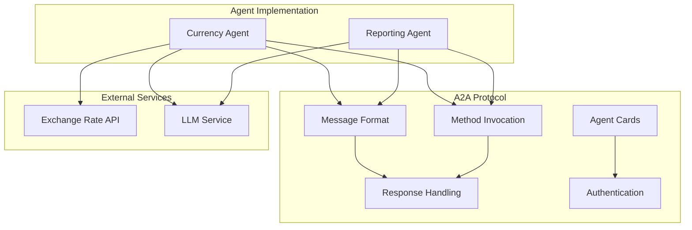
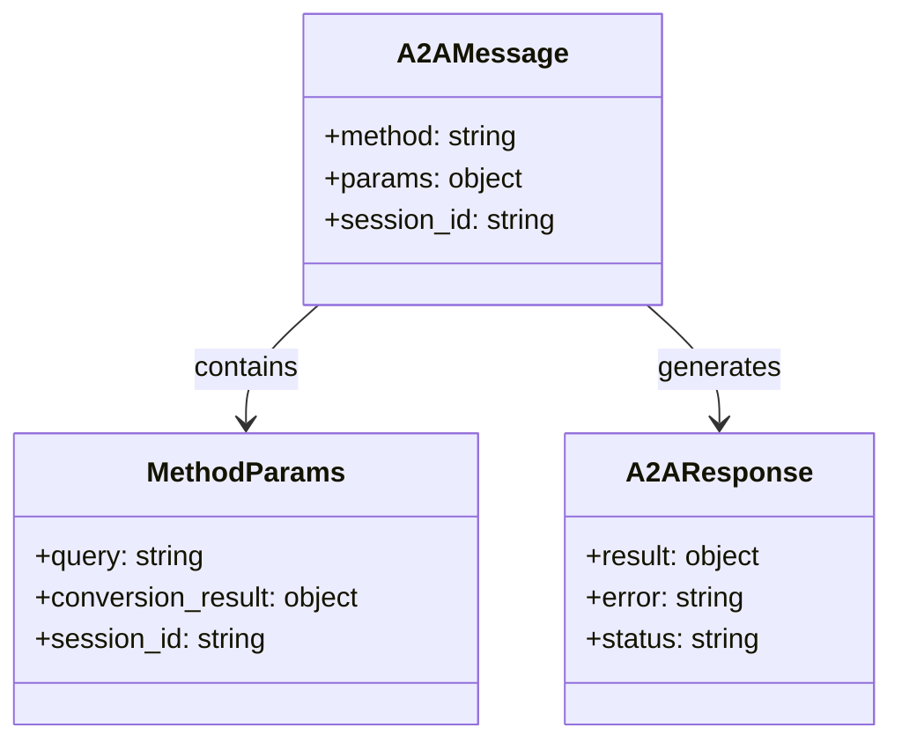
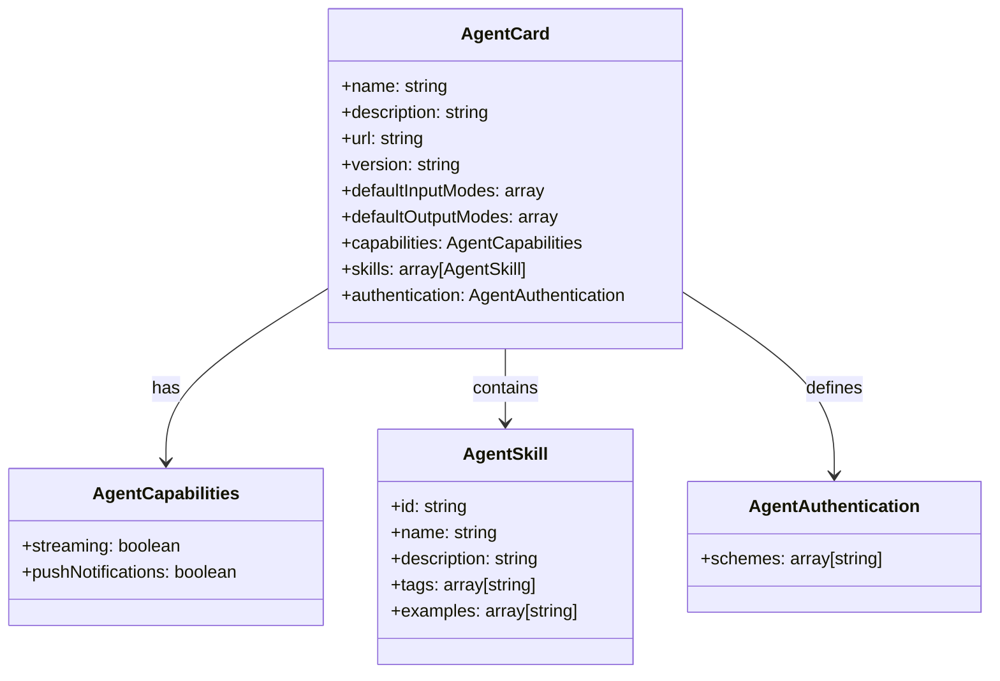
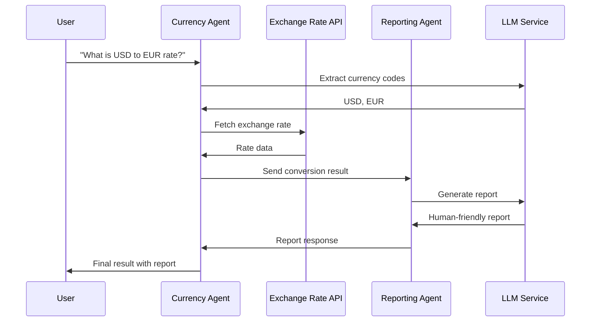
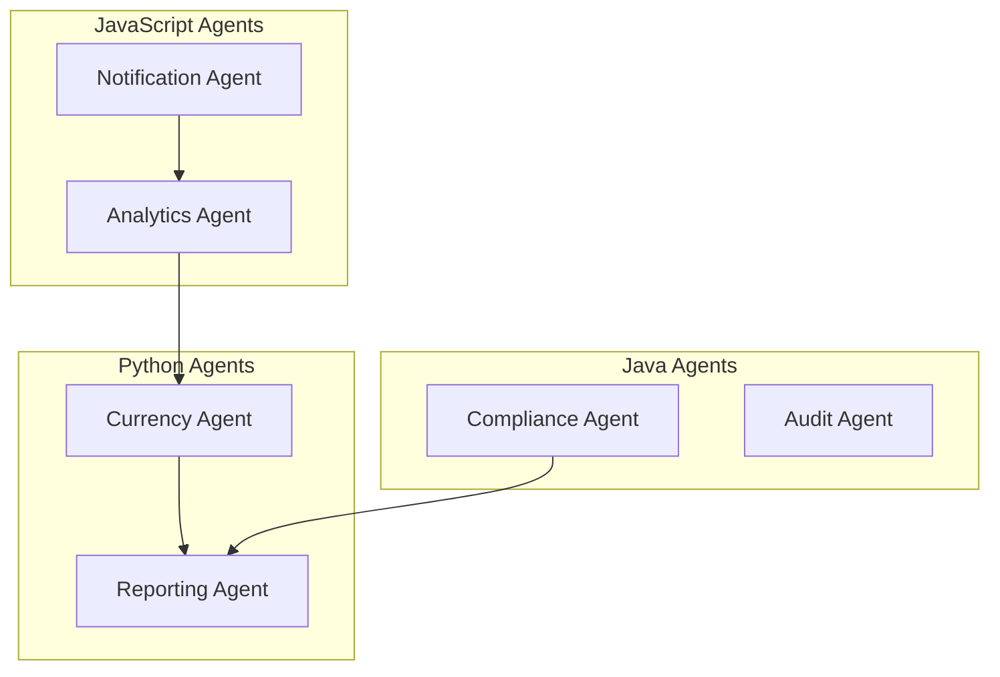
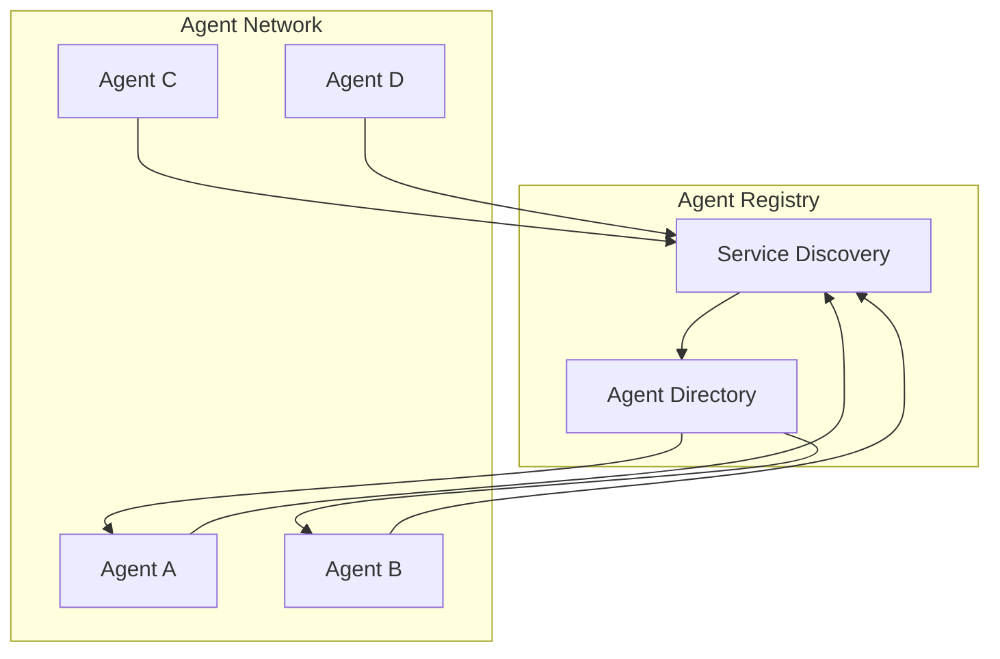
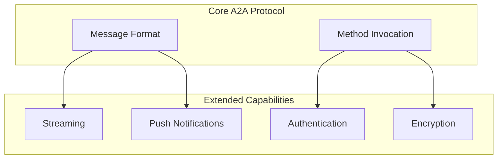
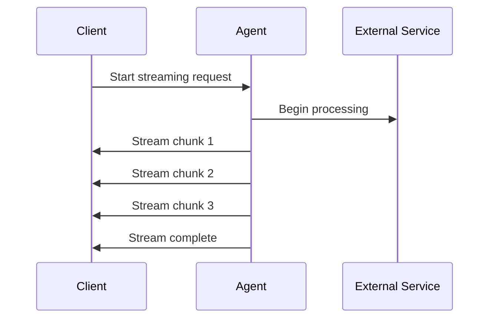
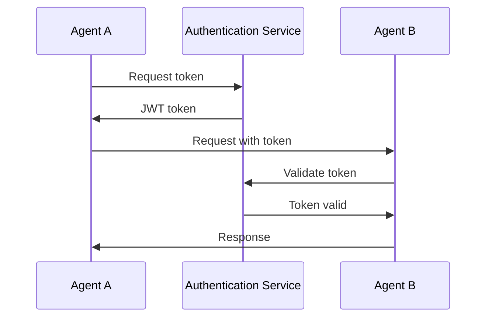

# Understanding Google's A2A Protocol: A Deep Dive into Agent-to-Agent Communication

## Introduction

Picture a digital landscape where intelligent agents—once confined to isolated tasks—are now the architects of complex, interconnected systems. From orchestrating financial transactions to powering smart assistants, these agents are reshaping how technology interacts with the world. Yet, as their influence expands, a critical question arises: How can these diverse agents seamlessly communicate, collaborate, and coordinate across different platforms and organizations?

Enter **Google’s Agent-to-Agent (A2A) protocol**—a groundbreaking standard designed to break down the barriers between AI agents. A2A provides a robust, extensible framework that empowers agents to exchange information, invoke each other’s capabilities, and work together seamlessly, regardless of their underlying technology or origin. Imagine a world where your currency conversion agent can instantly consult a reporting agent, or where specialized bots from different vendors can join forces to solve complex problems—A2A makes this vision a reality.

In this blog post, we’ll take you on a deep dive into the A2A protocol:  
- **Discover** its architecture and the core concepts that make it so powerful  
- **Uncover** the tangible benefits it brings to AI ecosystems, from interoperability to security  
- **See it in action** with a hands-on walkthrough of a real-world currency conversion and reporting system, where two autonomous agents collaborate using A2A to deliver accurate, auditable results

Whether you’re an AI developer, architect, or enthusiast, this guide will equip you with the knowledge and inspiration to harness the full potential of agent-to-agent communication.

## The Need for Unified Agent Communication

### The Problem: Fragmented AI Ecosystems

Before diving into A2A, let's understand why such a protocol was needed. The AI landscape has been characterized by:

1. **Isolated Systems**: AI agents developed by different organizations often operate in silos, unable to communicate or collaborate effectively.

2. **Proprietary Protocols**: Each AI system typically implements its own communication methods, making integration complex and expensive.

3. **Scalability Challenges**: As organizations deploy multiple AI agents, managing their interactions becomes increasingly complex without standardized protocols.

4. **Interoperability Issues**: Different AI frameworks, languages, and architectures create barriers to seamless agent collaboration.

### The Solution: A2A Protocol

Google's A2A protocol addresses these challenges by providing:

- **Standardized Communication**: A common language for agents to exchange messages and invoke methods
- **Interoperability**: Support for agents built with different technologies and frameworks
- **Extensibility**: A flexible architecture that can accommodate new capabilities and use cases
- **Security**: Built-in support for authentication and secure communication

## A2A Protocol Architecture

### Core Components

The A2A protocol is built around several key components:



### Message Structure

A2A messages follow a standardized format:



### Agent Card Specification

Each agent in the A2A ecosystem exposes an "Agent Card" that describes its capabilities:



## A2A Protocol in Action: Currency Conversion System

Let's examine how the A2A protocol works in practice using our currency conversion and reporting system.

### System Overview

Our implementation consists of two agents:

1. **Currency Agent**: Handles currency conversion requests and fetches real-time exchange rates
2. **Reporting Agent**: Generates human-friendly reports from conversion results



### Message Flow Example

Here's how the agents communicate using the A2A protocol:

#### Step 1: User Request
```json
{
  "method": "message/send_with_report",
  "params": {
    "query": "What is the exchange rate between USD and EUR?",
    "session_id": "test-session"
  }
}
```

#### Step 2: Currency Agent Processing
The Currency Agent:
1. Extracts currency codes using an LLM
2. Fetches exchange rate from external API
3. Sends result to Reporting Agent

#### Step 3: Inter-Agent Communication
```json
{
  "method": "message/send",
  "params": {
    "conversion_result": {
      "from": "USD",
      "to": "EUR",
      "rate": 0.85,
      "raw": {...}
    },
    "session_id": "test-session"
  }
}
```

#### Step 4: Reporting Agent Response
```json
{
  "result": {
    "status": "completed",
    "report": "On July 8th, 2025, 1 US dollar (USD) was equivalent to 0.85 euros (EUR)."
  }
}
```

### Implementation Details

#### Currency Agent Implementation

The Currency Agent demonstrates several key A2A concepts:

```python
class CurrencyAgent:
    def __init__(self, host: str = 'localhost', port: int = 8000):
        self.model = ChatGoogleGenerativeAI(model="gemini-1.5-flash")
        self.tools = [get_exchange_rate, call_reporting_agent]
        self.agent_card = self.get_agent_card(host, port)
        
    @staticmethod
    def get_agent_card(host: str, port: int) -> AgentCard:
        return AgentCard(
            name='Currency Agent',
            description='Helps with exchange rates for currencies',
            url=f'http://{host}:{port}/',
            version='1.0.0',
            capabilities=AgentCapabilities(streaming=True, pushNotifications=True),
            skills=[AgentSkill(
                id='convert_currency',
                name='Currency Exchange Rates Tool',
                description='Helps with exchange values between various currencies',
                tags=['currency conversion', 'currency exchange'],
                examples=['What is exchange rate between USD and GBP?']
            )],
            authentication=AgentAuthentication(schemes=['public'])
        )
```

#### A2A Endpoint Implementation

Both agents expose standardized A2A endpoints:

```python
@app.post("/a2a")
async def a2a_endpoint(request: Request):
    data = await request.json()
    method = data.get("method")
    params = data.get("params", {})
    session_id = params.get("session_id", "default-session")
    
    if method == "message/send":
        result = await executor.on_message_send(query, session_id)
        return JSONResponse({"result": result})
    elif method == "message/send_with_report":
        result = await executor.on_message_send_with_report(query, session_id)
        return JSONResponse({"result": result})
```

## Key Benefits of A2A Protocol

### 1. Interoperability

A2A enables agents built with different technologies to communicate seamlessly:



### 2. Scalability

The protocol supports horizontal scaling and agent discovery:



### 3. Extensibility

New capabilities can be added without breaking existing integrations:



## Advanced A2A Features

### Streaming Support

A2A supports real-time streaming for long-running operations:



### Authentication and Security

The protocol includes built-in security features:



## Best Practices for A2A Implementation

### 1. Error Handling

Implement robust error handling for network failures and invalid requests:

```python
async def call_reporting_agent(conversion_result: dict, session_id: str) -> dict:
    try:
        async with httpx.AsyncClient() as client:
            response = await client.post(
                'http://localhost:5002/a2a',
                json={
                    'method': 'message/send',
                    'params': {
                        'conversion_result': conversion_result,
                        'session_id': session_id
                    }
                }
            )
            if response.status_code == 200:
                return response.json().get('result', {})
            else:
                return {'status': 'error', 'report': 'Failed to get report'}
    except Exception as e:
        return {'status': 'error', 'report': f'Network error: {str(e)}'}
```

### 2. Session Management

Maintain session context for multi-turn conversations:

```python
async def invoke(self, query: str, session_id: str) -> dict[str, Any]:
    config: RunnableConfig = {'configurable': {'thread_id': session_id}}
    result = await self.graph.ainvoke({'messages': [('user', query)]}, config)
    return self.get_agent_response(config)
```

### 3. Agent Discovery

Implement service discovery for dynamic agent networks:

```python
class AgentRegistry:
    def __init__(self):
        self.agents = {}
    
    def register_agent(self, agent_id: str, agent_card: AgentCard):
        self.agents[agent_id] = agent_card
    
    def discover_agents(self, capability: str) -> list[AgentCard]:
        return [card for card in self.agents.values() 
                if any(skill.id == capability for skill in card.skills)]
```

## Future Directions

### 1. Enhanced Discovery

Future versions of A2A may include:
- Automatic agent discovery using service mesh patterns
- Dynamic capability negotiation
- Load balancing and failover mechanisms

### 2. Advanced Security

- End-to-end encryption for sensitive data
- Role-based access control (RBAC)
- Audit logging and compliance features

### 3. Performance Optimizations

- Connection pooling for high-throughput scenarios
- Caching mechanisms for frequently accessed data
- Compression for large payloads

## Conclusion

Google's A2A protocol represents a significant step forward in enabling interoperable, scalable AI agent ecosystems. By providing a standardized communication framework, A2A addresses the fragmentation challenges that have hindered AI system integration.

The currency conversion system we've examined demonstrates how A2A enables:
- **Modular Design**: Each agent has a specific responsibility
- **Loose Coupling**: Agents communicate through well-defined interfaces
- **Extensibility**: New agents can be added without modifying existing ones
- **Reliability**: Standardized error handling and response formats

As AI systems become more complex and organizations deploy multiple specialized agents, protocols like A2A will become increasingly important for building maintainable, scalable AI architectures.

The implementation shown in this project provides a practical foundation for understanding and working with A2A, serving as a template for building more sophisticated multi-agent systems.

## Resources

- [Google A2A Protocol Documentation](https://developers.google.com/ai/agent-to-agent)
- [Project Repository](https://github.com/bhanu-singh/googlea2a-demo)
- [LangGraph Documentation](https://langchain-ai.github.io/langgraph/)

